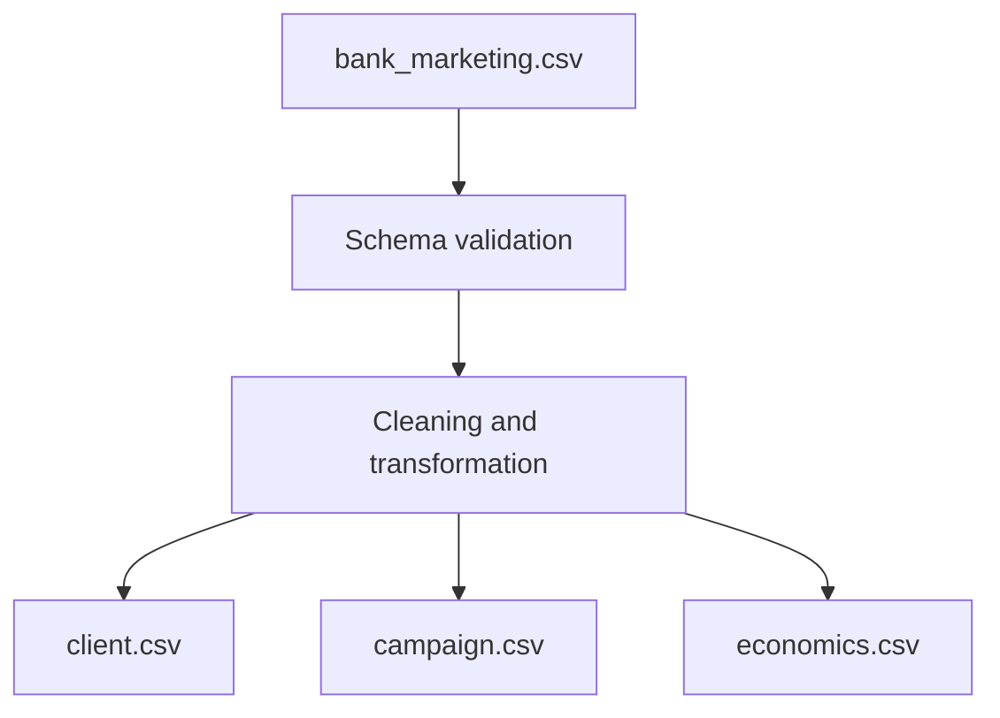

# Bank Marketing Campaign Data Cleaning

A reproducible ETL project that cleans and restructures raw bank marketing campaign data into three PostgreSQL-ready datasets.

## Project Overview

A bank collected customer, campaign, and economic data during a personal-loan marketing campaign. The original data was stored in a single CSV file, but the bank requires a consistent structure that can be loaded into a PostgreSQL database and reused for future campaigns.

This project:

1. reads the raw marketing dataset;
2. separates the data into three business domains;
3. cleans categorical and missing values;
4. converts columns to the required data types;
5. creates a standardized contact date;
6. validates the resulting datasets; and
7. exports three clean CSV files without pandas index columns.

## Business Objective

The bank plans to conduct additional marketing campaigns in the future. A standardized data pipeline helps ensure that new campaign data can be validated, transformed, and imported consistently.

The cleaned data can support questions such as:

* Which customer segments respond most positively to loan offers?
* Does contact frequency affect campaign success?
* Are customers with a successful previous outcome more likely to convert again?
* How does campaign performance vary under different economic conditions?
* Which customer and campaign characteristics are most strongly associated with conversion?

## ETL Workflow



### Extract

The raw `bank_marketing.csv` file is loaded into a pandas DataFrame.

### Transform

The source data is:

* divided into three business domains;
* standardized using consistent category names;
* converted to the required boolean and datetime types;
* checked for aligned row counts and client identifiers.

### Load

The cleaned DataFrames are exported as:

```text
client.csv
campaign.csv
economics.csv
```

The files are ready for downstream analysis or import into PostgreSQL.

## Output Datasets

### `client.csv`

Contains customer characteristics.

| Column           | Data type | Transformation                                                   |
| ---------------- | --------- | ---------------------------------------------------------------- |
| `client_id`      | integer   | Retained as the customer identifier                              |
| `age`            | integer   | Retained as supplied                                             |
| `job`            | object    | Replaced `.` with `_`                                            |
| `marital`        | object    | Retained as supplied                                             |
| `education`      | object    | Replaced `.` with `_` and converted `unknown` to a missing value |
| `credit_default` | boolean   | `True` when the original value is `yes`; otherwise `False`       |
| `mortgage`       | boolean   | `True` when the original value is `yes`; otherwise `False`       |

### `campaign.csv`

Contains current and previous campaign activity.

| Column                       | Data type | Transformation                                                 |
| ---------------------------- | --------- | -------------------------------------------------------------- |
| `client_id`                  | integer   | Retained as the customer identifier                            |
| `number_contacts`            | integer   | Retained as supplied                                           |
| `contact_duration`           | integer   | Retained as supplied                                           |
| `previous_campaign_contacts` | integer   | Retained as supplied                                           |
| `previous_outcome`           | boolean   | `True` when the original value is `success`; otherwise `False` |
| `campaign_outcome`           | boolean   | `True` when the original value is `yes`; otherwise `False`     |
| `last_contact_date`          | datetime  | Created from `day`, `month`, and campaign year `2022`          |

The final contact date is exported using the ISO format:

```text
YYYY-MM-DD
```

### `economics.csv`

Contains economic indicators associated with each campaign observation.

| Column                 | Data type | Description                    |
| ---------------------- | --------- | ------------------------------ |
| `client_id`            | integer   | Customer identifier            |
| `cons_price_idx`       | float     | Monthly consumer price index   |
| `euribor_three_months` | float     | Daily three-month Euribor rate |

## Cleaning Rules

The pipeline applies the following transformations:

* replaces periods with underscores in `job`;
* replaces periods with underscores in `education`;
* converts `unknown` education values to `NaN`;
* converts `credit_default` to boolean;
* converts `mortgage` to boolean;
* converts previous campaign success to boolean;
* converts current campaign success to boolean;
* creates `last_contact_date` using campaign year `2022`;
* removes the temporary `year`, `month`, and `day` columns;
* exports every CSV with `index=False`.

## Data Validation

Before export, the project checks:

* expected column names;
* output row counts;
* alignment of `client_id` values;
* integer, float, boolean, and datetime data types;
* missing education values;
* unsupported month values;
* final dataset dimensions;
* absence of unwanted pandas index columns.

The completed pipeline produces three datasets containing 41,188 aligned records each:

```text
client:    41,188 rows × 7 columns
campaign:  41,188 rows × 7 columns
economics: 41,188 rows × 3 columns
```

## Repository Structure

```text
bank-marketing-data-cleaning/
├── data/
│   ├── raw/
│   │   └── .gitkeep
│   └── processed/
│       └── .gitkeep
├── notebooks/
│   └── bank_marketing_cleaning.ipynb
├── src/
│   └── clean_data.py
├── .gitignore
├── README.md
└── requirements.txt
```

The raw and generated CSV files are excluded from version control. This keeps the repository lightweight and avoids redistributing data without confirming its license.

## Installation

Clone the repository:

```bash
git clone https://github.com/NChalatsis/bank-marketing-data-cleaning.git
cd bank-marketing-data-cleaning
```

Create a virtual environment:

```bash
python -m venv .venv
```

Activate it on Windows:

```bash
.venv\Scripts\activate
```

Activate it on macOS or Linux:

```bash
source .venv/bin/activate
```

Install the dependencies:

```bash
pip install -r requirements.txt
```

## Usage

Place the source dataset at:

```text
data/raw/bank_marketing.csv
```

Run the reusable cleaning pipeline from the repository root:

```bash
python src/clean_data.py
```

The generated files will be written to:

```text
data/processed/client.csv
data/processed/campaign.csv
data/processed/economics.csv
```

## Technologies

* Python
* pandas
* NumPy
* Jupyter Notebook
* CSV
* PostgreSQL-ready relational design
* Git and GitHub

## Skills Demonstrated

* Data cleaning and transformation
* ETL pipeline development
* Schema and data-type validation
* Missing-value handling
* Categorical standardization
* Boolean feature encoding
* Datetime construction
* Relational data modeling
* Reproducible project organization
* Technical and business documentation

## Source and Usage Note

This portfolio implementation is based on DataCamp's **Cleaning Bank Marketing Campaign Data** project.

The source and generated CSV files are not included in this public repository. Review the applicable dataset license and platform terms before redistributing the data.

## Author

[Nikos Chalatsis](https://github.com/NChalatsis)
